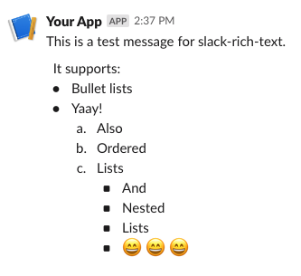

# Slack Rich Text

Small library to create slack messages with rich text using the BlockKit.

## Installing

`npm i slack-rich-text`

## Usage

Use the exported function as a template string tag to create a rich text message.
To apply the transformation to a string inside some other function, like using `bold` on a list, use the `section` function.

Example:
```javascript
import { bullets, emoji, ordered, richText, section } from "slack_rich_text";

const blocks = richText`
  This is a test message for slack-rich-text.

  It supports:
  ${bullets([
    "Bullet lists",
    "Yaay!",
    ordered([
      "Also",
      "Ordered",
      "Lists", 
      bullets([
        "And", 
        "Nested", 
        "Lists",
        section`${emoji("smile")} ${emoji("smile")} ${emoji("smile")}`
      ])
    ])
  ])}
`;
```
Renders as:



## API Reference

See the [API Reference](./API.md) for a detailed explanation of the available functions.